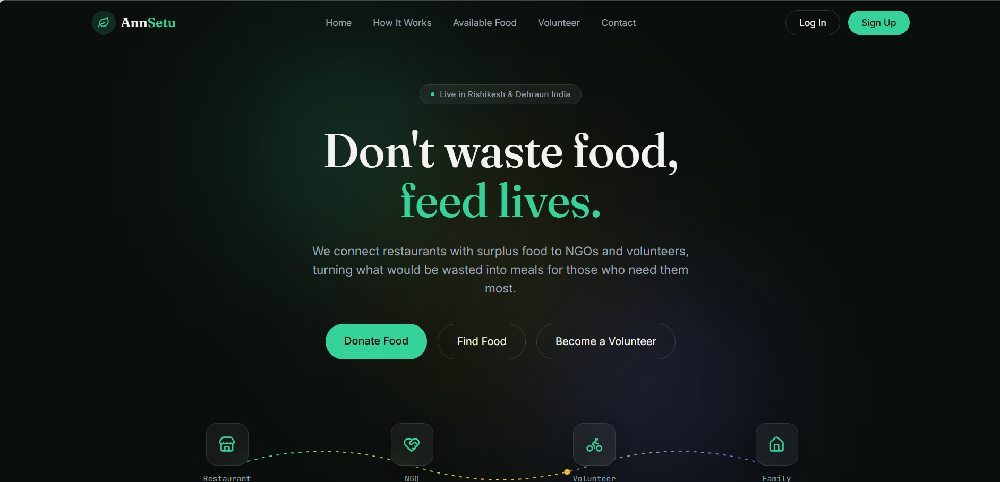

# 🌿 AnnSetu — Don't Waste Food, Feed Lives

AnnSetu is a full-stack food donation platform that connects restaurants with surplus food to NGOs and volunteers, turning what would be wasted into meals for those who need them most.

**🔗 Live Demo:** [annsetu-app.vercel.app](https://annsetu-app.vercel.app)


---

## 📖 Overview

Every day, tons of good food goes to waste while people go hungry. AnnSetu bridges this gap by creating a transparent, verified workflow connecting four types of users — **Restaurants**, **NGOs**, **Volunteers**, and **Admins** — to ensure surplus food reaches those who need it, safely and efficiently.

## ✨ Key Features

### 🔐 Authentication & Security
- Role-based registration (Restaurant / NGO / Volunteer / Admin)
- Email OTP verification on signup
- Forgot / reset password flow with OTP
- JWT-based session management
- Admin approval workflow before account activation

### 🍽️ Core Donation Lifecycle
- Restaurants post surplus food with photos, quantity, and expiry time
- Interactive map-based pickup location selection (Leaflet.js)
- NGOs discover nearby donations sorted by distance (Haversine formula) with list/map toggle
- Volunteers claim pickup tasks and manage deliveries
- **Two-step OTP verification** - restaurant confirms pickup, NGO confirms delivery, ensuring end-to-end accountability

### ⭐ Ratings & Feedback
- NGOs rate restaurants and volunteers after successful delivery
- Average ratings displayed on user profiles

### 📊 Live Impact Dashboard
- Public, real-time statistics pulled directly from the database (restaurants onboard, meals delivered, active volunteers)

### 🌍 Public Pages
- Available Food page - anyone can view live pending donations without logging in
- Fully responsive landing page with animated hero section

### 👤 Profile Management
- Editable profiles with photo upload for every role
- Admin dashboard to approve, reject, or revoke user access

### 📧 Notifications
- Automated email alerts for registration OTP, login activity, password resets, and admin approval/rejection (via Brevo API)

---

## 🛠️ Tech Stack

**Frontend**
- React (Vite)
- Tailwind CSS v4
- Framer Motion (animations)
- React Router
- Leaflet.js / React-Leaflet (maps)
- Axios

**Backend**
- Node.js + Express.js
- MongoDB + Mongoose
- JWT authentication
- Bcrypt (password hashing)
- Brevo API (transactional email)

**Deployment**
- Backend hosted on **Render**
- Frontend hosted on **Vercel**
- Database hosted on **MongoDB Atlas**

---

## 🏗️ Architecture Highlights

- **Distance-based matching engine** using the Haversine formula to sort donations by proximity for NGOs
- **Two-step OTP verification** system for both pickup and delivery, preventing fraud and ensuring accountability at every handoff
- **Role-based access control** enforced via middleware on both API routes and frontend route guards
- **Non-blocking email architecture** - email failures never block core user actions like login or registration

---

## 📱 User Roles & Flow

Restaurant → Posts surplus food (with photo & location)
↓
NGO → Views nearby donations, accepts one
↓
Volunteer → Claims pickup task
↓
Restaurant generates Pickup OTP → Volunteer verifies → Status: Picked Up
↓
NGO generates Delivery OTP → Volunteer verifies → Status: Delivered
↓
NGO rates the Restaurant & Volunteer


Admin oversees the entire platform — approving new users, monitoring activity, and managing access.

---

## 🚀 Getting Started (Local Setup)

### Backend
```bash
cd backend
npm install
# create a .env file with MONGO_URI, JWT_SECRET, BREVO_API_KEY, BREVO_SENDER_EMAIL
npm run dev
```

### Frontend
```bash
cd frontend
npm install
npm run dev
```

---

## 📸 Screenshots



---

## 👨‍💻 Author

Built by **Ayush** as a full-stack learning project - covering authentication, real-time-style workflows, geolocation, email integration, and full deployment.

---

## 📄 License

This project is open for educational purposes.